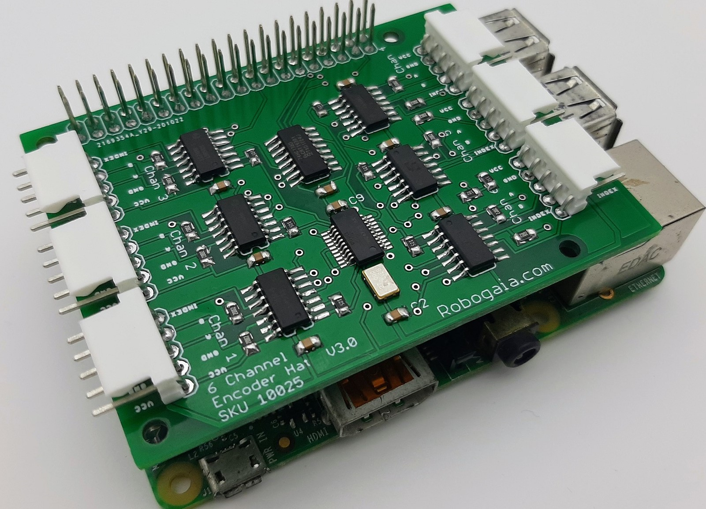

# Raspberry_Pi_Encoder_Hat_6_Channel

This is the python code for Raspberry Pi 6 Channel Encoder Hat: https://www.robogaia.com/raspberry-pi-6-channel-encoder-hat.html
To run the code use: python ./Test_6_chan_encoder_plate.py

The C-Code consists of the SPI_Encoder.c

Steps to build:

1. enable SPI

2. install pigpio (C-library)

3. install spidev (C-library)

4. Compile code with:
gcc -Wall -pthread SPI_Encoder.c -o SPI_Encoder -lpigpio -lrt
sudo ./SPI_Encoder -D /dev/spidev0.0